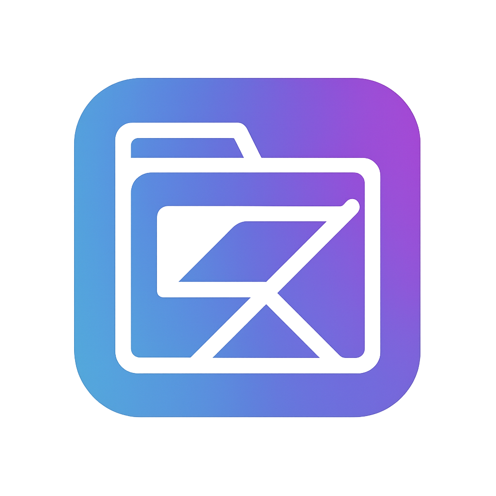

# NoBoringTab 🚀

A customizable and elegant new tab page for Google Chrome designed to boost productivity, aesthetic appeal, and daily motivation. This Chrome extension replaces your default new tab with a highly interactive and visually pleasing dashboard.



---

## ✨ Features

### 📅 Productivity Tools
- **Quick Access Dashboard** - Frequently visited or user-defined favorite links with favicons
- **To-Do List Integration** - LocalStorage-based task management with priorities and completion tracking
- **Pomodoro Timer** - Timer with customizable intervals and visual progress indicators
- **Daily Goals Tracker** - Set and track up to 3 daily goals with progress visualization

### 🎨 Aesthetic & Informational
- **Dynamic Backgrounds** - Daily background from Unsplash API or beautiful gradient options
- **Minimal Clock & Greeting** - Display time and personalized greeting based on time of day
- **Daily Quote** - Motivational quotes from Quotable API with sharing capabilities
- **Live Weather** - Location-based weather data from OpenWeatherMap with detailed information
- **Ambient Sound Player** - Lo-fi and nature sounds for better focus

### 🎉 Creative Additions
- **"Today I Learned" Box** - Interesting facts from Wikipedia API
- **Journaling Prompt** - Daily random writing prompts with local storage
- **AI Assistant Snippet** - Interactive chat-style interface for quick assistance

### 📈 Development & Analytics
- **GitHub Contributions Graph** - Display recent activity using GitHub API
- **Time Spent Today** - Track time spent per domain with visual analytics
- **System Stats** - Display usage statistics and productivity metrics

### 🔐 Focus & Privacy
- **Distraction Blocker** - Block listed sites during work mode
- **Focus Mode** - Minimal layout for distraction-free productivity
- **Incognito Mode Safe** - Minimal layout with no API calls or saved state

---

## 🛠️ Tech Stack

- **Frontend**: HTML5, CSS3 (Tailwind CSS), Vanilla JavaScript
- **Architecture**: Chrome Extension APIs (Manifest V3)
- **Storage**: Chrome Storage API with localStorage fallback
- **APIs**: 
  - [Unsplash API](https://unsplash.com/developers) for backgrounds
  - [OpenWeatherMap](https://openweathermap.org/api) for weather data
  - [GitHub REST API](https://docs.github.com/en/rest) for contributions
  - [Quotable](https://github.com/lukePeavey/quotable) for daily quotes
  - Wikipedia API for interesting facts

---

## 📁 Project Structure

```
NoBoringTab/
│
├── manifest.json              # Extension configuration
├── index.html                 # Main new tab page
├── README.md                  # Documentation
│
├── styles/
│   └── tailwind.css          # Custom styles and animations
│
├── scripts/
│   ├── main.js               # Main application logic
│   ├── utils.js              # Utility functions and API helpers
│   ├── background.js         # Service worker for time tracking
│   ├── todo.js               # Todo list functionality
│   └── timer.js              # Pomodoro timer logic
│
├── components/
│   ├── Clock.js              # Clock and greeting component
│   ├── Weather.js            # Weather widget component
│   └── QuoteBox.js           # Daily quote functionality
│
└── assets/
    ├── icon16.png            # Extension icon (16x16)
    ├── icon32.png            # Extension icon (32x32)
    ├── icon48.png            # Extension icon (48x48)
    └── icon128.png           # Extension icon (128x128)
```

---

## ⚡ Quick Start

### Installation

1. **Download or Clone the Extension**
   ```bash
   git clone https://github.com/Anass-NB/NoBoringTab.git
   cd NoBoringTab
   ```

2. **Load Extension in Chrome**
   - Open Chrome and navigate to `chrome://extensions/`
   - Enable **Developer Mode** (toggle in top right)
   - Click **Load unpacked** and select the `NoBoringTab` directory
   - The extension will appear in your extensions list

3. **Open New Tab**
   - Open a new tab to see your new dashboard
   - The extension will automatically replace Chrome's default new tab page

### Initial Setup

1. **Configure Settings** (⚙️ button)
   - Set your name for personalized greetings
   - Choose background source (Unsplash/Gradient)
   - Set weather location

2. **Add API Keys** (for full functionality)
   - **OpenWeatherMap**: Get free API key from [openweathermap.org](https://openweathermap.org/api)
   - **GitHub** (optional): Personal access token for higher rate limits
   - **Unsplash** (optional): Access key for more background options

---

## 🔧 Configuration

### API Keys Setup

1. **Weather API Key**
   ```javascript
   // In scripts/utils.js, update the CONFIG object:
   const CONFIG = {
       OPENWEATHER_API_KEY: 'your-api-key-here'
   };
   ```

2. **GitHub Integration**
   - Enter your GitHub username in the GitHub widget
   - Optional: Add personal access token for higher API limits

3. **Unsplash Backgrounds**
   - Uses Unsplash Source API (no key required) by default
   - For advanced features, add Unsplash Access Key

### Customization Options

- **Background Sources**: Unsplash daily images, gradients, or solid colors
- **Time Format**: 12-hour or 24-hour clock display
- **Weather Location**: Auto-detect or manual city entry
- **Quick Access Links**: Add your most-visited websites
- **Daily Goals**: Set up to 3 goals per day
- **Ambient Sounds**: Choose from rain, forest, ocean, or coffee shop sounds

---

## 🎯 Usage Guide

### Productivity Features

**Quick Access**
- Click the "+" button to add frequently visited websites
- Links automatically fetch favicons for visual recognition
- Remove links by hovering and clicking the "×" button

**Todo List**
- Add tasks using the input field or Enter key
- Set task priorities (high, normal, low) using the flag button
- Mark tasks complete with checkboxes
- Edit tasks by double-clicking or using the edit button

**Pomodoro Timer**
- Default: 25 minutes work, 5 minutes break
- Click play to start, pause to pause, stop to reset
- Automatic break notifications and sound alerts
- Tracks daily Pomodoro count

**Daily Goals**
- Set up to 3 meaningful goals each day
- Check off completed goals for motivation
- Goals reset automatically at midnight

### Information Widgets

**Weather**
- Shows current temperature, location, and conditions
- Hover for detailed information (humidity, wind, etc.)
- Updates automatically every 10 minutes

**Daily Quote**
- New inspirational quote daily
- Click "New Quote" for different quote
- Copy quote by clicking on it

**Today I Learned**
- Random interesting fact from Wikipedia
- Click "New Fact" to load different fact
- Educational content to spark curiosity

### Focus Tools

**Focus Mode**
- Click the eye icon to enter focus mode
- Blurs non-essential widgets to reduce distractions
- Toggle back to normal view anytime

**Ambient Sounds**
- Choose from nature sounds and white noise
- Helps maintain concentration during work
- Volume controlled through browser

### Keyboard Shortcuts

- `Ctrl/Cmd + ,` - Open Settings
- `Ctrl/Cmd + F` - Toggle Focus Mode
- `Ctrl/Cmd + R` - Reload Extension
- `Alt + Q` - New Quote
- `Alt + T` - New TIL Fact
- `Alt + W` - Refresh Weather

---

## 🔒 Privacy & Data

### Local Storage
- All personal data stored locally in browser
- No data sent to external servers (except API calls)
- Chrome Storage Sync for cross-device synchronization

### API Usage
- Weather: Location data sent to OpenWeatherMap
- Backgrounds: No personal data sent to Unsplash
- GitHub: Only public profile information accessed
- Quotes: No personal data sent to quote APIs

### Incognito Mode
- Automatically detects incognito/private browsing
- Minimal layout with no API calls or data storage
- Maintains privacy while providing basic functionality

---

## 🚀 Advanced Features

### Time Tracking
- Automatically tracks time spent on different domains
- Daily usage statistics with visual breakdowns
- Historical data kept for 7 days
- No personal browsing data stored

### GitHub Integration
- Display public profile information
- Show recent repository activity
- Contribution graph visualization
- Motivation for developers

### Journal Prompts
- Daily writing prompts for self-reflection
- Entries saved locally with date stamps
- Export functionality for backup
- Promotes mindfulness and goal-setting

---

## 🛠️ Development

### Local Development

1. **Make Changes**
   - Edit files directly in the extension directory
   - Changes to HTML/CSS are reflected immediately
   - JavaScript changes require extension reload

2. **Reload Extension**
   ```
   1. Go to chrome://extensions/
   2. Find NoBoringTab
   3. Click the reload icon
   4. Open new tab to test changes
   ```

3. **Debug Issues**
   - Right-click on new tab page → Inspect
   - Check Console for errors
   - Use Chrome DevTools for debugging

### Adding New Features

1. **New Widget Component**
   ```javascript
   // Create new component file in components/
   class NewWidget {
       constructor() {
           this.init();
       }
       
       async init() {
           // Initialize widget
       }
   }
   
   // Initialize in main.js
   window.newWidget = new NewWidget();
   ```

2. **New API Integration**
   ```javascript
   // Add to utils.js CONFIG
   const CONFIG = {
       NEW_API_KEY: 'your-key-here'
   };
   
   // Use API class for requests
   const data = await API.get('https://api.example.com/data');
   ```

### Performance Optimization

- **Lazy Loading**: Components initialize only when needed
- **Caching**: API responses cached to reduce requests
- **Debouncing**: User input debounced to prevent excessive API calls
- **Background Tasks**: Heavy operations run in service worker

---

## 📝 Changelog

### Version 1.0.0
- Initial release with all core features
- Complete Chrome Extension Manifest V3 support
- Responsive design for all screen sizes
- Full API integration suite
- Comprehensive error handling

---

## 🤝 Contributing

We welcome contributions! Here's how you can help:

### Bug Reports
1. Check existing issues first
2. Create detailed bug report with steps to reproduce
3. Include browser version and error messages

### Feature Requests
1. Search existing feature requests
2. Describe the feature and use case
3. Explain how it fits with existing functionality

### Code Contributions
1. Fork the repository
2. Create feature branch: `git checkout -b feature-name`
3. Make changes with proper comments
4. Test thoroughly across different scenarios
5. Submit pull request with detailed description

### Development Guidelines
- Follow existing code style and patterns
- Add comments for complex logic
- Test all features before submitting
- Ensure cross-browser compatibility
- Maintain performance standards

---

## 📄 License

MIT License - see [LICENSE](LICENSE) file for details.

---

## 🙏 Acknowledgments

- **Unsplash** for beautiful background images
- **OpenWeatherMap** for reliable weather data
- **Quotable** for inspirational quotes
- **Tailwind CSS** for utility-first styling
- **Font Awesome** for beautiful icons
- **Chrome Extensions Team** for excellent APIs

---

## 📞 Support

- **Issues**: [GitHub Issues](https://github.com/Anass-NB/NoBoringTab/issues)
- **Discussions**: [GitHub Discussions](https://github.com/Anass-NB/NoBoringTab/discussions)
- **Email**: [anass.nb@example.com](mailto:anass.nb@example.com)

---

## 🌟 Show Your Support

If you find NoBoringTab helpful, please:
- ⭐ Star the repository
- 🐛 Report bugs and suggest features
- 🔄 Share with friends and colleagues
- 💻 Contribute code improvements

**Made with ❤️ by [Anass-NB](https://github.com/Anass-NB)**